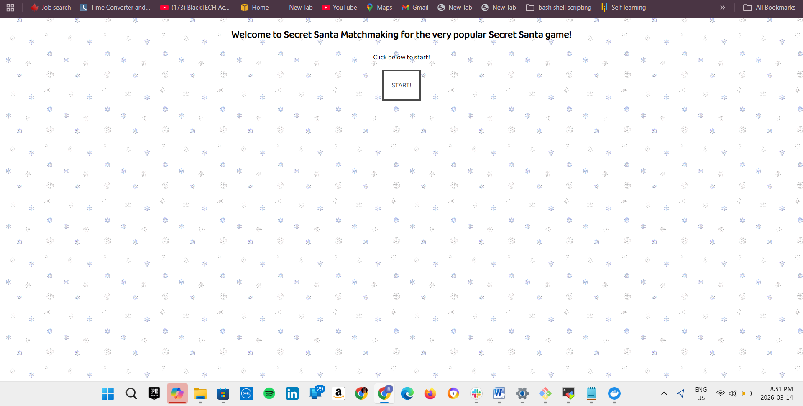
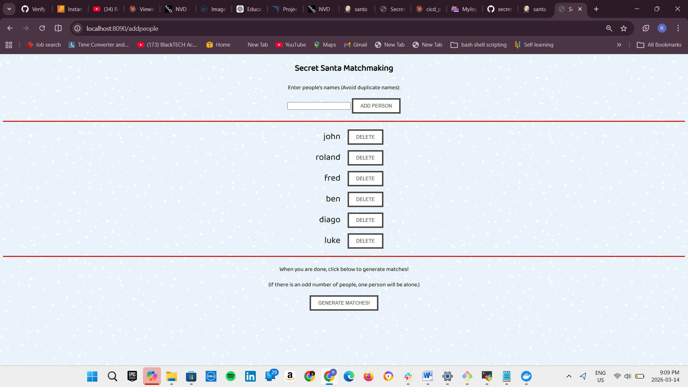
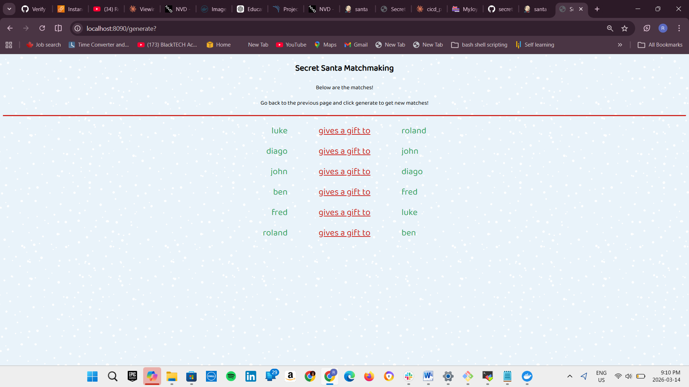

# 🎅 Secret Santa Generator

A Spring Boot web application that randomly generates Secret Santa matches from a list of names.
Built and deployed through a full CI/CD pipeline using Jenkins, Docker, and security scanning tools.

🌐 **Live Demo:** http://<your-server-ip>:8090

---

## 🚀 CI/CD Pipeline

This project is deployed via an automated Jenkins pipeline with the following stages:
```
Git Checkout → Code Compile → SonarQube Analysis → OWASP Dependency Check → Code Build → Docker Build & Push → Deploy
```

| Stage | Tool | Purpose |
|---|---|---|
| Source control | GitHub | Version control & pipeline trigger |
| Build | Maven | Compile and package the application |
| Code quality | SonarQube | Static analysis and code smell detection |
| Security scan | OWASP Dependency Check | CVE vulnerability scanning |
| Containerization | Docker | Build and push image to Docker Hub |
| Deployment | Docker | Run container on remote server |

---

## 🛠️ Tech Stack

**Application**
- Java 17
- Spring Boot
- Spring MVC (Model-View-Controller)
- Thymeleaf (templating engine)
- JPA & H2 in-memory database

**DevOps**
- Jenkins (CI/CD orchestration)
- Maven (build tool)
- SonarQube (code quality)
- OWASP Dependency Check (security)
- Docker & Docker Hub (containerization)
- GitHub (source control)

---

## 🐳 Run with Docker (quickest way)
```bash
docker pull agodzo/santa123:latest
docker run -d --name santa-app -p 8090:8080 agodzo/santa123:latest
```

Then open: `http://localhost:8090`

---

## 💻 Run Locally (without Docker)
```bash
git clone https://github.com/karris12/secretsanta-generator.git
cd secretsanta-generator
./mvnw spring-boot:run
```

Then open: `http://localhost:8080`

---

## 🗄️ Database

Uses an H2 in-memory database — no setup required.

To access the H2 console, enable it in `application.properties`:
```properties
spring.h2.console.enabled=true
```
Then visit: `http://localhost:8080/h2-console`
Database URL: `jdbc:h2:mem:testdb`

---

## 📂 Project Structure
```
secretsanta-generator/
├── src/
│   ├── main/
│   │   ├── java/        # Controllers, Services, Repositories, Models
│   │   └── resources/   # Thymeleaf templates, application.properties
│   └── test/
├── Jenkinsfile           # Full CI/CD pipeline definition
├── Dockerfile
└── pom.xml
```

---

## 🔑 Key Concepts Demonstrated

- Spring MVC architecture with Service and Repository layers
- Thymeleaf server-side rendering
- JPA entity and repository management
- Secret Santa matching algorithm (directed graph problem)
- End-to-end CI/CD pipeline from commit to deployment
- Container-based deployment with Docker
- Automated security and code quality gates

---

## 📸 Screenshots

| Welcome Page | Add Names | Generated Matches |





---

*Built as a hands-on DevOps learning project — from Spring Boot development to full pipeline automation.*
